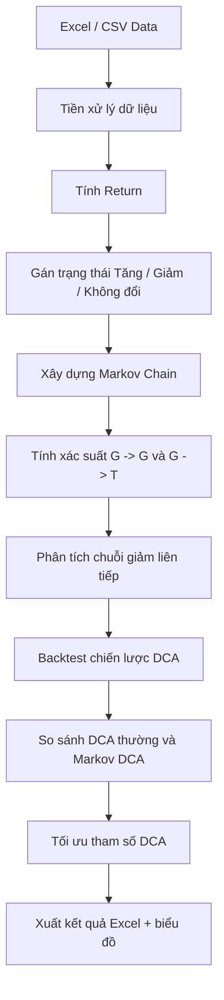

EVERYTHING HERE IS A BASE INSTEAD OF REAL RESEARCH, REAL RESEARCH WILL BE PROVIDED ON DEMAND: hoanhson219@gmail.com
# DCA-refinement-
DCA strat refinment using price data, specialized for vn30 derivatives, and ETF DCVFMVN30
<div align="center">

# 📉 Markov Chain DCA Backtesting for VN30

### Phân tích chuỗi giảm giá và tối ưu chiến lược DCA bằng Markov Chain


</div>

## 🧠 Tổng quan đề tài

Dự án này phân tích biến động giá theo hướng **Tăng / Giảm** và sử dụng **Markov Chain** để kiểm tra khả năng xuất hiện các chuỗi giảm liên tiếp.  
Từ kết quả đó, notebook thực hiện **backtesting nhiều chiến lược DCA** nhằm so sánh:

| Nhóm chiến lược | Ý tưởng |
|---|---|
| **DCA thông thường** | Mua định kỳ sau mỗi số phiên cố định |
| **DCA 3 ngày** | Mua liên tiếp trong 3 ngày sau tín hiệu giảm |
| **Markov DCA tối ưu** | Khi xuất hiện cụm giảm, mua trong 5-6 ngày, cách 2 ngày/lần |
| **Grid Search DCA** | Tự thử nhiều bộ tham số để tìm cấu hình tốt hơn |

Mục tiêu không phải là “dự đoán tương lai chắc chắn”, vì thị trường mà nghe lời chắc chắn thì ai cũng giàu rồi và Excel đã thành ngân hàng trung ương.  
Mục tiêu thực tế hơn là **kiểm tra xem logic DCA nào hợp lý hơn trên dữ liệu lịch sử**.

---

## 🎯 Mục tiêu nghiên cứu

Dự án tập trung trả lời các câu hỏi:

1. Sau một ngày giảm, xác suất tiếp tục giảm là bao nhiêu?
2. Các chuỗi giảm có xuất hiện thành cụm hay không?
3. DCA trong 3 ngày có quá ngắn không?
4. Nếu rải vốn trong 5-6 ngày, cách 2 ngày/lần, kết quả có tốt hơn không?
5. So với DCA thông thường, chiến lược Markov DCA có cải thiện:
   - Lợi nhuận cuối kỳ?
   - Số lần mua?
   - Drawdown?
   - Khả năng rải vốn khi thị trường giảm?

---

## 🧩 Pipeline xử lý



---

## 📁 Cấu trúc file

```text
.
├── phan_tich_markov_dca_backtest_optimized.ipynb
├── README_optimized.md
├── data/
│   ├── VN30_2020_2026.csv
│   └── other_market_data.xlsx
└── markov_dca_backtest_results.xlsx
```

| File | Vai trò |
|---|---|
| `phan_tich_markov_dca_backtest_optimized.ipynb` | Notebook chính, gồm phân tích Markov Chain và backtesting |
| `README_optimized.md` | Tài liệu giới thiệu dự án |
| `data/` | Thư mục đặt dữ liệu VN30 hoặc dữ liệu thị trường khác |
| `markov_dca_backtest_results.xlsx` | File kết quả được notebook tự xuất sau khi chạy |

---

## 📊 Dữ liệu đầu vào

Notebook hỗ trợ dữ liệu dạng `.xlsx` hoặc `.csv`.

### Cấu trúc tối thiểu

| Cột | Ý nghĩa | Ví dụ tên cột được hỗ trợ |
|---|---|---|
| Ngày giao dịch | Thời gian của phiên | `Ngày`, `Date`, `TradingDate` |
| Giá đóng cửa / lần cuối | Giá dùng để tính tăng giảm | `Lần cuối`, `Close`, `Adj Close`, `Last`, `Price` |

Ví dụ:

| Ngày | Lần cuối |
|---|---:|
| 2024-01-01 | 1200.5 |
| 2024-01-02 | 1195.2 |
| 2024-01-03 | 1188.0 |


## 🔢 Markov Chain trong dự án

Mỗi phiên giao dịch được chuyển thành trạng thái:

| Ký hiệu | Ý nghĩa |
|---|---|
| `T` | Giá tăng so với phiên trước |
| `G` | Giá giảm so với phiên trước |
| `N` | Giá không đổi |

Sau đó tính ma trận chuyển trạng thái:

\[
P(G \rightarrow G) = \frac{\text{số lần }G \rightarrow G}{\text{tổng số lần bắt đầu từ }G}
\]

\[
P(G \rightarrow T) = \frac{\text{số lần }G \rightarrow T}{\text{tổng số lần bắt đầu từ }G}
\]

Ví dụ từ phần phân tích ban đầu:

```text
P(G -> G) = 60 / 131 = 45.8%
P(G -> T) = 71 / 131 = 54.2%
```

Xác suất giảm 5 ngày liên tiếp theo logic Markov có thể được ước lượng bằng:

\[
P(\text{5 ngày giảm}) = P(G \rightarrow G)^4
\]


## 📉 Logic DCA được kiểm tra

### 1. DCA thông thường

Mua định kỳ mỗi `n` phiên.

Ví dụ:

```text
Mua mỗi 5 ngày giao dịch
Mua mỗi 10 ngày giao dịch
```

### 2. DCA cũ: 3 ngày

Khi xuất hiện chuỗi giảm đủ điều kiện, mua liên tiếp trong 3 ngày.

```text
Ngày tín hiệu: mua
Ngày +1: mua
Ngày +2: mua
```

### 3. Markov DCA tối ưu: 5-6 ngày, 2 ngày/lần

Dựa trên nhận xét rằng các cụm giảm có thể kéo dài hoặc xuất hiện không hoàn toàn liền nhau, chiến lược mới rải vốn chậm hơn:

```text
Ngày tín hiệu: mua
Ngày +2: mua
Ngày +4: mua
```

Chiến lược này giúp tránh việc dùng hết vốn quá sớm ngay đầu nhịp giảm.

---

## 🧪 Backtesting

Notebook backtest các chiến lược theo logic:

- Mỗi tín hiệu mua dùng cùng một lượng tiền.
- Mua tại giá `Close`.
- Giữ đến cuối kỳ.
- Không tính phí giao dịch và thuế.
- So sánh bằng:
  - Tổng số lần mua.
  - Tổng vốn đã đầu tư.
  - Giá trị cuối kỳ.
  - Lãi/lỗ.
  - Tỷ suất lợi nhuận.
  - Max Drawdown.

| Chỉ số | Ý nghĩa |
|---|---|
| `Buy_Count` | Số lần mua |
| `Invested` | Tổng vốn đã bỏ ra |
| `Final_Value` | Giá trị danh mục cuối kỳ |
| `PnL` | Lãi/lỗ tuyệt đối |
| `Total_Return` | Tỷ suất sinh lời |
| `Max_Drawdown` | Mức sụt giảm lớn nhất của giá trị danh mục |

---

## ⚙️ Tối ưu tham số

Notebook thử nhiều tổ hợp tham số:

| Tham số | Ý nghĩa |
|---|---|
| `Trigger_Down_Days` | Số ngày giảm liên tiếp để kích hoạt DCA |
| `Interval_Days` | Khoảng cách giữa các lần mua |
| `Tranches` | Số lần mua sau mỗi tín hiệu |
| `Cooldown_Days` | Khoảng nghỉ để tránh tín hiệu chồng lên nhau |

Ví dụ cấu hình:

```python
trigger_down_days = 3
interval_days = 2
tranches = 3
cooldown_days = 5
```

Tương ứng:

```text
Giảm 3 ngày liên tiếp -> kích hoạt
Mua 3 lần
Mỗi lần cách nhau 2 phiên
Nghỉ 5 phiên trước khi nhận tín hiệu mới
```

---

## 🚀 Cách chạy

### Bước 1: Cài thư viện

```bash
pip install pandas numpy openpyxl matplotlib
```

### Bước 2: Mở notebook

```bash
jupyter notebook phan_tich_markov_dca_backtest_optimized.ipynb
```

Hoặc dùng VS Code / Google Colab.

### Bước 3: Thêm dữ liệu

Đặt file dữ liệu vào thư mục `data/`:

```text
data/VN30_2020_2026.csv
data/VN30_2023_2024.xlsx
```

Sau đó sửa biến:

```python
DATA_FILES = [
    "data/VN30_2020_2026.csv",
    "data/VN30_2023_2024.xlsx"
]
```

### Bước 4: Run All

Chạy toàn bộ notebook từ trên xuống dưới.  
Notebook sẽ tự xuất file:

```text
markov_dca_backtest_results.xlsx
```

---

## 📤 Kết quả đầu ra

Notebook tạo 3 bảng chính:

### `markov_summary`

| Cột | Ý nghĩa |
|---|---|
| `P_G_to_G` | Xác suất sau ngày giảm tiếp tục giảm |
| `P_G_to_T` | Xác suất sau ngày giảm chuyển sang tăng |
| `GG_Patterns` | Số chuỗi giảm-giảm |
| `Expected_GG_Per_Month` | Số chuỗi giảm-giảm kỳ vọng mỗi tháng |
| `Prob_5_Down_Days_Markov` | Xác suất giảm 5 ngày liên tiếp theo Markov |

### `backtest_summary`

So sánh DCA thường, DCA 3 ngày và DCA Markov 5-6 ngày.

### `optimization_result`

Danh sách các bộ tham số DCA được thử nghiệm và xếp hạng.

---

## 📝 Nhận xét nghiên cứu

Từ kết quả ban đầu:

```text
P(G -> G) = 45.8%
P(G -> T) = 54.2%
```

Điều này cho thấy sau một ngày giảm, thị trường không chắc chắn tiếp tục giảm, nhưng xác suất giảm tiếp vẫn đủ lớn để kiểm tra chiến lược DCA theo cụm.

Điểm quan trọng là:

> Không nên chỉ nhìn xác suất chuỗi giảm liên tiếp tuyệt đối.  
> Cần kiểm tra cả tần suất xuất hiện các cụm giảm trong khoảng thời gian giao dịch thực tế.


Chiến lược hợp lý hơn là rải vốn trong **5-6 ngày**, cách **2 ngày/lần**, sau đó dùng backtesting để xác nhận.


## ✅ Checklist hoàn thành

- [x] Tách code thành từng bước rõ ràng trong Jupyter Notebook.
- [x] Thêm comment giải thích từng phần.
- [x] Kiểm tra lại logic Markov Chain.
- [x] Thêm phân tích chuỗi giảm liên tiếp.
- [x] Thêm backtest DCA thông thường.
- [x] Thêm backtest DCA theo tín hiệu giảm.
- [x] Thêm chiến lược DCA 5-6 ngày, 2 ngày/lần.
- [x] Thêm tối ưu tham số DCA.
- [x] Xuất kết quả ra Excel.
- [x] Viết README theo format GitHub.

---

## ⚠️ Giới hạn

Dự án hiện tại vẫn có một số giới hạn:

1. Chưa tính phí giao dịch và thuế.
2. Chưa tính trượt giá khi mua.
3. Dữ liệu demo không đại diện cho VN30 thật.
4. Backtest chỉ kiểm tra mua và nắm giữ tới cuối kỳ.
5. Chưa có quản trị vốn nâng cao.
6. Chưa kiểm định thống kê sâu như walk-forward validation hoặc bootstrap.


## 🔮 Hướng phát triển

- Thêm phí giao dịch và thuế.
- Backtest trên dữ liệu VN30 nhiều năm.
- So sánh với Buy & Hold.
- So sánh theo từng giai đoạn thị trường.
- Thêm kiểm định walk-forward.
- Thêm Monte Carlo simulation.
- Kết hợp thêm RSI, MA, MACD để xác nhận tín hiệu.
- Tối ưu chiến lược theo drawdown thay vì chỉ lợi nhuận.


> DCA trong 5-6 ngày, cách 2 ngày/lần, là hướng hợp lý hơn DCA dồn trong 3 ngày khi thị trường xuất hiện cụm giảm.

Tuy nhiên, kết luận cuối cùng phải dựa trên backtest nhiều dữ liệu và nhiều giai đoạn thị trường.  
Thị trường chứng khoán rất giỏi làm nhục những kết luận viết quá tự tin.
